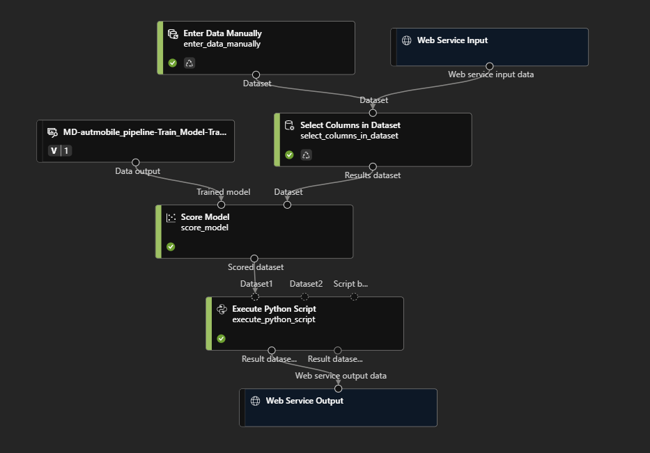

### For Instructor Use Only


https://learn.microsoft.com/en-us/azure/machine-learning/tutorial-designer-automobile-price-train-score?view=azureml-api-1

https://github.com/kuljotSB/AI-900-fundamentals/blob/main/instructions/02a-create-regression-model.md

### Real-Time Inferencing Pipeline

Enter Data Manually Component:
```csv
symboling,normalized-losses,make,fuel-type,aspiration,num-of-doors,body-style,drive-wheels,engine-location,wheel-base,length,width,height,curb-weight,engine-type,num-of-cylinders,engine-size,fuel-system,bore,stroke,compression-ratio,horsepower,peak-rpm,city-mpg,highway-mpg
3,NaN,alfa-romero,gas,std,two,convertible,rwd,front,88.6,168.8,64.1,48.8,2548,dohc,four,130,mpfi,3.47,2.68,9,111,5000,21,27
3,NaN,alfa-romero,gas,std,two,convertible,rwd,front,88.6,168.8,64.1,48.8,2548,dohc,four,130,mpfi,3.47,2.68,9,111,5000,21,27
1,NaN,alfa-romero,gas,std,two,hatchback,rwd,front,94.5,171.2,65.5,52.4,2823,ohcv,six,152,mpfi,2.68,3.47,9,154,5000,19,26
```

Execute python script component:
```python
import pandas as pd

def azureml_main(dataframe1 = None, dataframe2 = None):

    scored_results = dataframe1[['Scored Labels']]
    scored_results.rename(columns={'Scored Labels':'predicted_price'},
                    inplace=True)
    return scored_results
```

Final Designer Pipeline should look something like this 




>**Note**: Before deploying model, provide the system assigned managed identity of ML workspace, the ACI contributor role at the resource group level

Use the following CURL request to infer your model:
```CURL
curl -X POST "YOUR_SCORING_ENDPOINT" -H "Content-Type: application/json" -H "Authorization: Bearer YOUR_API_KEY" -d "{\"Inputs\":{\"WebServiceInput0\":[{\"symboling\":3,\"normalized-losses\":null,\"make\":\"alfa-romero\",\"fuel-type\":\"gas\",\"aspiration\":\"std\",\"num-of-doors\":\"two\",\"body-style\":\"convertible\",\"drive-wheels\":\"rwd\",\"engine-location\":\"front\",\"wheel-base\":88.6,\"length\":168.8,\"width\":64.1,\"height\":48.8,\"curb-weight\":2548,\"engine-type\":\"dohc\",\"num-of-cylinders\":\"four\",\"engine-size\":130,\"fuel-system\":\"mpfi\",\"bore\":3.47,\"stroke\":2.68,\"compression-ratio\":9,\"horsepower\":111,\"peak-rpm\":5000,\"city-mpg\":21,\"highway-mpg\":27}]},\"GlobalParameters\":{}}"
```